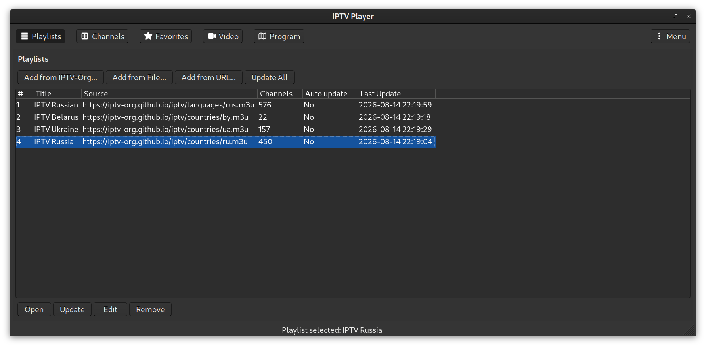
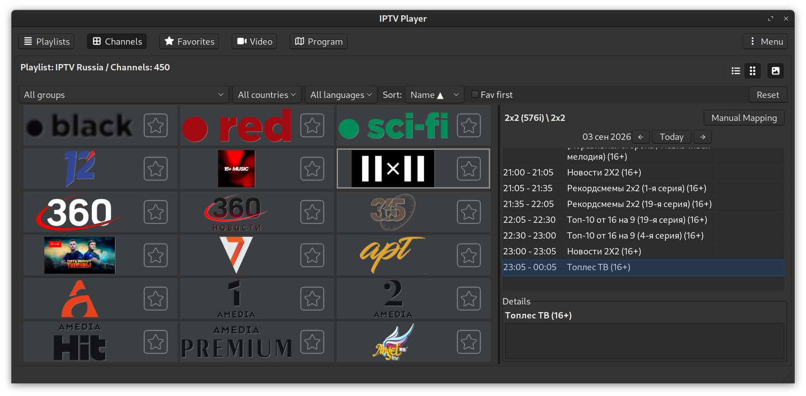
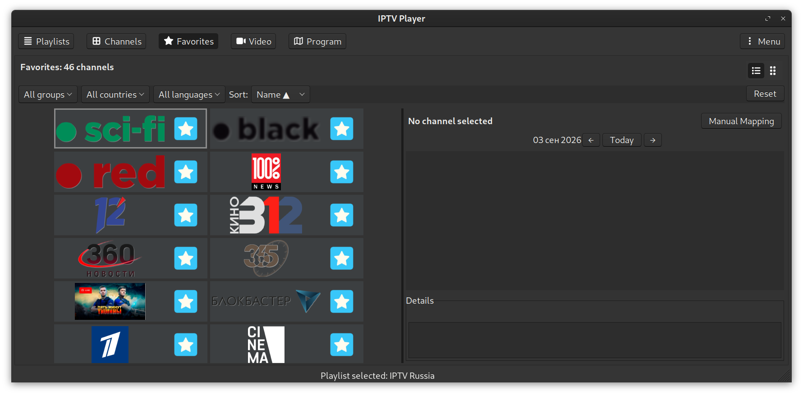
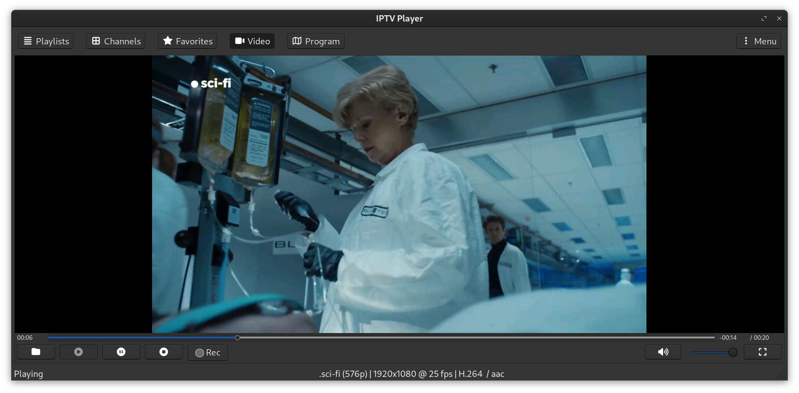
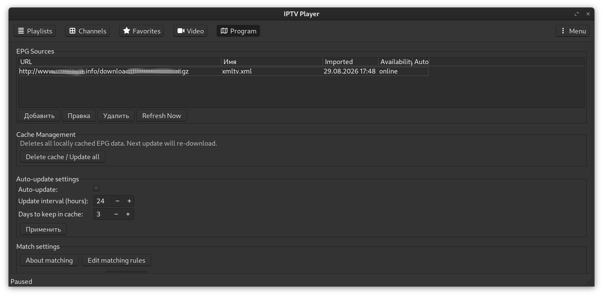

# IPTV Player

## Screenshots

| Playlists | Channels |
|-----------|----------|
|  |  |

| Favorites | Video |
|-----------|-------|
|  |  |

| Program | |
|---------|---|
|  | |
---

## 1. Requirements

Install required system packages (Debian/Ubuntu example):

    sudo apt update
    sudo apt install -y build-essential cmake pkg-config libcurl4-openssl-dev libgtk-3-dev autoconf automake libtool

You need:

- A C++20‑capable compiler (GCC 10+ or Clang 12+)
- CMake ≥ 3.16
- `git` (for version information)
- `autoconf`, `automake`, `libtool` (for wxSQLite3 build)
- `wget` or `curl`

Optional but recommended: `ninja` for faster builds (fallback to `make`).

---

## 2. Installing Dependencies

This project uses locally built static dependencies:

- wxWidgets 3.3.2 (with builtin libwebp)
- wxSQLite3 5.0.1

Dependencies are installed **automatically** by the `setup-deps.sh` script.

From the project root, simply run:

    ./setup-deps.sh

This will:

- Download wxWidgets 3.3.2 and build it statically with builtin libwebp.
- Download wxSQLite3 5.0.1 and build it statically against the local wxWidgets.

All dependencies are installed into:

    third_party/wx/install/
    third_party/wxsqlite3/install/

These paths are already configured in `CMakeLists.txt`, so no further setup is required.

> **For developers:** The exact commands used by the script are available inside `setup-deps.sh` if you need to customise the build.

---

## 3. Building iptvplayer

The recommended way is to use the helper script:

    ./build-release.sh          # Release build
    ./build-release.sh --type debug   # Debug build

For a full list of options, see [Section 5.2](#52-build-releasesh--build-and-install).

Alternatively, you can build manually (for development only):

    mkdir build && cd build
    cmake .. -DCMAKE_BUILD_TYPE=Debug
    cmake --build . -j$(nproc)

Manual builds do **not** perform dependency checks or install icons correctly for system-wide use – use the scripts for reliable packaging.

---

## 4. Running

- **From build directory:** `./build/iptvplayer` – resources (JSON, icons) are copied during build.
- **From install directory:** `cd install/bin && ./iptvplayer` – this is the portable version ready for distribution.

The application loads icons from `DATADIR/iptvplayer/icons/` (system installation) or from `exeDir/icons/` (next to the binary for development). This ensures icons work both in development and after installation.

---

## 5. Developer Automation Scripts

### 5.1. `setup-deps.sh` – Install Dependencies

Downloads and builds wxWidgets and wxSQLite3 statically into `third_party/`.

**Usage:**

    ./setup-deps.sh

- If a dependency already exists, the script will ask whether to skip or rebuild.
- Dependencies are installed into:
  - `third_party/wx/install/`
  - `third_party/wxsqlite3/install/`

These paths are already configured in `CMakeLists.txt`.

---

### 5.2. `build-release.sh` – Build and Install

Builds the project and installs it to a local directory (default: `install/`).

**Usage:**

    ./build-release.sh [OPTIONS]

| Option | Description |
| :----- | :---------- |
| `--clean` | Remove previous build and install directories before building |
| `--type release\|debug` | Build type (default: `release`) |
| `--prefix PATH` | Installation directory (default: `../install` relative to project root) |
| `--log` | Save build log to a timestamped file |
| `-h, --help` | Show help |

**Examples:**

    # Release build with default settings
    ./build-release.sh

    # Debug build with clean
    ./build-release.sh --clean --type debug

    # Install to /opt/iptvplayer (requires sudo)
    sudo ./build-release.sh --prefix /opt/iptvplayer

    # Build with logging
    ./build-release.sh --log

**What it does:**

1. Checks that dependencies are present (warns if not).
2. Creates a build directory `build-release/` or `build-debug/`.
3. Configures CMake with the chosen build type and install prefix.
4. Builds the project (using `make` or `ninja` automatically).
5. Installs the executable, icons, and resource files to the prefix.
6. Copies `compile_commands.json` to the project root for IDE support.

**After installation:** the application can be run from the installation directory, e.g.:

    cd install/bin && ./iptvplayer

---

## 6. IDE Support

After any build, `compile_commands.json` is generated and copied to the project root. This enables:

- **VSCode** with `clangd` or Microsoft C/C++ extension
- **CLion**
- **ccls**

Install `clangd` (recommended):

    sudo apt install clangd-16   # Ubuntu/Debian

Then install the clangd extension in VSCode – it will use `compile_commands.json` automatically.

---

## 7. Summary of Common Commands

| Task | Command |
| :--- | :--- |
| Install dependencies | `./setup-deps.sh` |
| Build release (default) | `./build-release.sh` |
| Build debug | `./build-release.sh --type debug` |
| Clean and rebuild | `./build-release.sh --clean` |
| Build with logging | `./build-release.sh --log` |
| Install to custom prefix | `./build-release.sh --prefix /your/path` |
| Run the app | `cd install/bin && ./iptvplayer` |

---

## 8. Application Data Directories

| Path | Purpose |
| :--- | :--- |
| `~/.config/iptvplayer/config.json` | Main settings (JSON) |
| `~/.config/iptvplayer/playlists/*.json` | Playlist metadata |
| `~/.config/iptvplayer/favorites.json` | Favorite channels |
| `~/.cache/iptvplayer/icons/` | Cached channel logos (disk) |
| `~/.config/iptvplayer/epg.db` | Cached EPG data (SQLite) |

The config file is created automatically on first run.

---

## 9. Features

- **Playlist management:** add local/remote M3U playlists, edit, update, remove.
- **Channel views:** list or grid (cards) with sorting and search.
- **Favorites:** mark channels, view separately.
- **EPG (Electronic Program Guide):**
  - XMLTV sources configuration (Settings → EPG).
  - Auto‑update interval and cache expiration.
  - Program tab with day navigation and details.
  - Quick jump from channel context menu.
- **Video playback:** fullscreen, volume, mute, audio/subtitle tracks, speed control.
- **Recording:** record current stream to a user‑defined directory.
- **IPTV‑Org integration:** add playlists from the public IPTV‑Org repository.

---

## 10. Keyboard Shortcuts (Quick Reference)

| Key | Action |
| :--- | :--- |
| `Space` | Play / Pause |
| `Left` / `Right` | Seek –5s / +5s |
| `Shift+Left/Right` | Seek –30s / +30s |
| `Ctrl+Left/Right` | Seek –1s / +1s |
| `Home` / `End` | Go to start / end |
| `Up` / `Down` | Volume +5 / –5 |
| `Ctrl+Up/Down` | Volume +1 / –1 |
| `m` / `M` | Toggle mute |
| `[` / `]` | Speed –0.1 / +0.1 |
| `{` / `}` | Speed –0.5 / +0.5 |
| `Backspace` | Reset speed |
| `+` / `_` | Next / previous audio track |
| `v` / `V` | Toggle subtitles |
| `j` / `J` | Next subtitle track |
| `h` / `H` | Previous subtitle track |
| `f` / `F` | Toggle fullscreen (on Video tab) |
| `ESC` | Exit fullscreen |
| `q` / `Q` | Stop playback |

Full documentation is available in the **About** dialog.

---

## 11. Notes

- The scripts are designed for Linux; Windows and macOS will have separate build instructions later.
- The `.gitignore` file is already configured to ignore `build-*/`, `install/`, `third_party/`, and other generated files.
- After a successful build, you can package the `install/` directory for distribution.

---

**You are now ready to develop, use, and distribute iptvplayer!**
