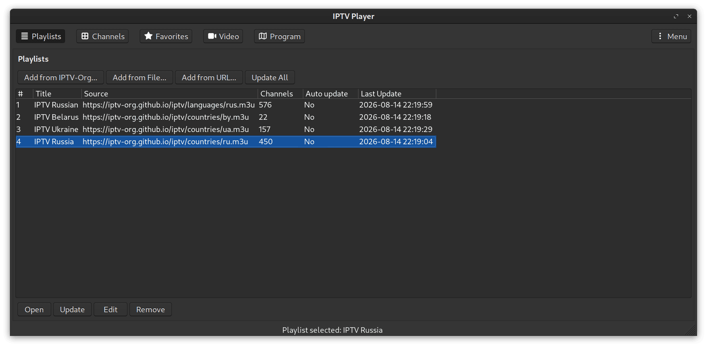
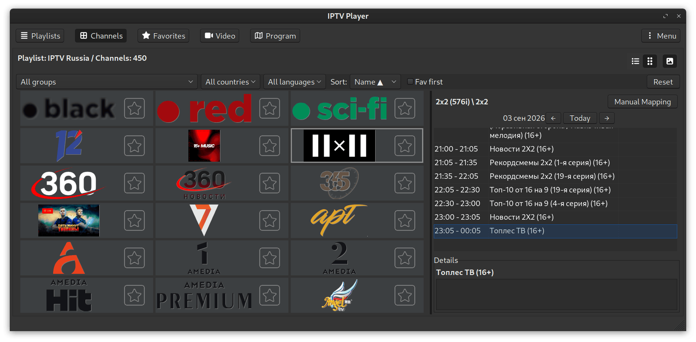
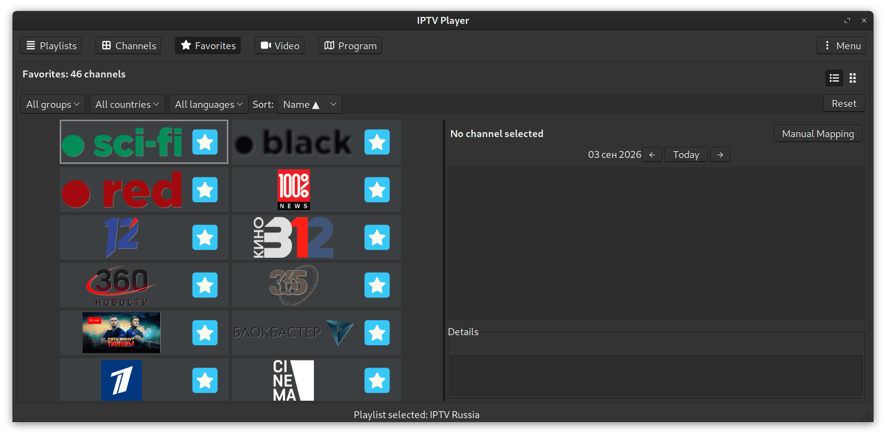
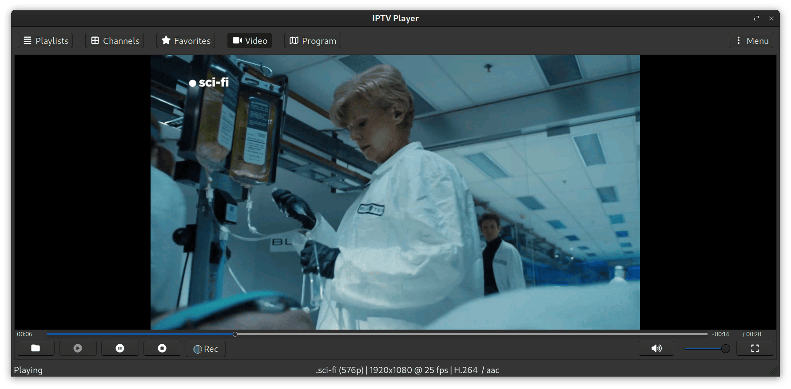
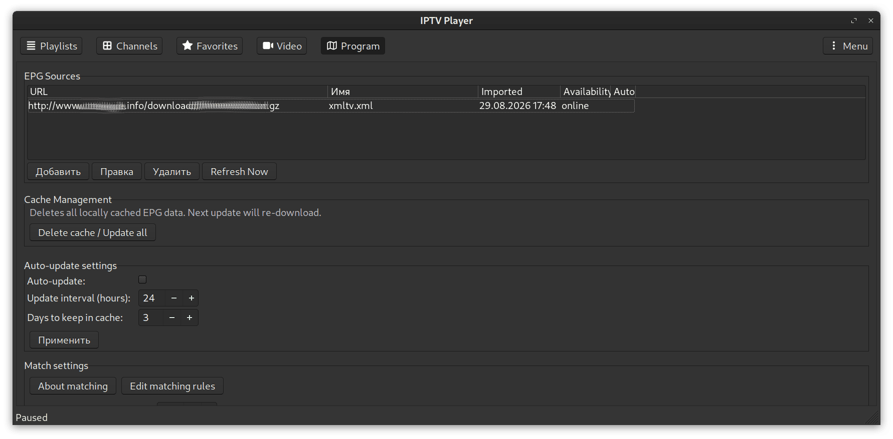

# IPTV Player

A IPTV player with M3U playlist support, favorites, channel logos, and an Electronic Program Guide (EPG).

---

## Screenshots

### Playlists

### Channels

### Favorites

### Video Player

### EPG Program

---

## Detailed usage guide

The full user guide — playlists, channels, EPG, manual mapping, recording, IPTV-Org, export, keyboard shortcuts, data locations:

- **[Online (GitHub Pages)](https://i-jurij.github.io/iptvplayer/)**
- **[Source (docs/index.html)](docs/index.html)**
- **Offline:** bundled with the app — **Menu → About → Details**.

---

## Installation

### From GitHub Releases

Pick the artifact that matches your system:

| Artifact | Target |
| :--- | :--- |
| `*.AppImage` | Any Linux with glibc ≥ 2.39 (built with `linuxdeploy`) |
| `*-sharun.AppImage` | Any Linux, including old glibc, musl systems (Alpine, Void-musl), NixOS without FHS |
| `*.deb` | Ubuntu 24.04+, Debian 13+ (bundled: installs under `/opt/iptvplayer`) |
| `*.rpm` | Fedora 44+, Rocky 10+ (bundled: installs under `/opt/iptvplayer`) |

All artifacts come with `checksums.txt` and a detached GPG signature.
See [SECURITY.md](SECURITY.md) for verification instructions.

### From source

See [Building and packaging](#building-and-packaging) below.

### Codec for H.264

Most IPTV streams are H.264. Some distributions do not include a decoder for it by default, and
playback fails with a black screen or `Unable to create decoder for h264`.

- **Fedora / RHEL:** `sudo dnf install openh264`.
- **Debian / Ubuntu:** `sudo apt install libopenh264-7`. If the package is not found, try
  `sudo apt install libavcodec-extra`.
- **Arch / Manjaro:** `sudo pacman -S ffmpeg` (H.264 decoding is included). Optionally also
  `sudo pacman -S openh264`.

Then restart the application.

### Hardware decoding

For smooth HD playback, install VA-API drivers (`va-driver-all` on Debian/Ubuntu, `mesa-va-drivers` on Fedora/RHEL, `libva-mesa-driver` on Arch, `nvidia-vaapi-driver` for NVIDIA).

---

## Building and packaging

### 1. Building a package for your system (recommended)

Everything is driven by one script:

    ./scripts/build-package.sh

Run it without arguments and you get an interactive menu tailored to your
distribution (Debian/Ubuntu, Fedora/Rocky/RHEL/openSUSE, Arch/Manjaro).
Pick a number — the script takes care of the rest: it builds the binary if
needed, prepares a staging tree, and produces the package in `dist/`.

Typical flows:

    # Interactive menu — choose what to build
    ./scripts/build-package.sh

    # .deb from system libraries (Debian/Ubuntu)
    ./scripts/build-package.sh --native-deb

    # .rpm from system libraries (Fedora/Rocky/RHEL/openSUSE)
    ./scripts/build-package.sh --native-rpm

    # .pkg.tar.zst (Arch/Manjaro)
    ./scripts/build-package.sh --native-arch

    # AppImage through linuxdeploy (classic pipeline)
    ./scripts/build-package.sh --appimage

    # AppImage through quick-sharun (maximum portability:
    # old glibc, musl systems, NixOS)
    ./scripts/build-package.sh --sharun

Use `./scripts/build-package.sh --help` for the full list of options.

**Which variant should I pick?**

- **Native** (`.deb` / `.rpm` / `.pkg.tar.zst`) — smallest download, but
  depends on libraries already present in your distribution. Only offered
  when the script recognises your system.
- **AppImage** — self-contained, runs on any glibc ≥ 2.39 system, no
  installation required.
- **AppImage (sharun)** — uses `quick-sharun` and embeds its own dynamic
  linker; can work on old distros, musl systems (Alpine, Void-musl) and
  NixOS without FHS.
- **Bundled** (`.deb` / `.rpm`) — self-contained packages that install
  everything under `/opt/iptvplayer`. These are separate from the native
  variants and are **not** offered in the interactive menu; build them
  explicitly with `--bundle-deb` / `--bundle-rpm` if you need them.

### 2. How the scripts fit together

Six scripts. Three are meant to be run by you, three are libraries sourced
by `build-package.sh`.

**User-facing:**

| Script | Role | When to run it |
| :--- | :--- | :--- |
| `scripts/setup-deps.sh` | Installs system packages, then builds wxWidgets and wxSQLite3 statically into `third_party/`. | Once, before the first build. `build-package.sh` does **not** run it for you. |
| `scripts/build-release.sh` | Configures CMake, builds the binary, installs into `--prefix` (default `install/`). Does not package. | Automatically called by `build-package.sh`, or manually for a plain build. |
| `scripts/build-package.sh` | Orchestrator. Calls `build-release.sh` if the binary is missing, then produces the requested artifacts in `dist/`. | Whenever you want a package. |

**Libraries** (not meant to be run directly):

| Script | Role |
| :--- | :--- |
| `scripts/common.sh` | Shared helpers: logging, `ask()`, `detect_arch` / `detect_distro` / `detect_pkgmgr`, `read_versions_from_install`, `prepare_staging`, `detect_deb_depends`, `check_deps`. |
| `scripts/build-native.sh` | Native `.deb` / `.rpm` / `.pkg.tar.zst` packagers. |
| `scripts/build-bundle.sh` | Bundled `.deb` / `.rpm` + AppImage. Contains `populate_appdir()` (the AppDir / `AppRun` logic). |
| `scripts/build-sharun.sh` | AppImage through `quick-sharun`. Contains `build_sharun_appimage()`. |

**Order of operations, in plain terms:**

1. `scripts/setup-deps.sh` — one-time prep, produces static dependencies.
2. `scripts/build-package.sh <flags>` —
   - reads `METAINFO_NAME`, detects architecture (`DEB_ARCH`, `RPM_ARCH`, `APPIMAGE_ARCH`) and distribution (`DISTRO`);
   - checks for required tools (`dpkg-deb`, `rpmbuild`, `wget`, `tar`, `readelf`, `gpg` if signing, …);
   - if `install/bin/iptvplayer` is missing (or `--rebuild` given) — calls `build-release.sh --type release --prefix ./install --yes`;
   - reads `install/VERSION{,_FULL,_FILE}`;
   - for bundled/AppImage: populates `iptvplayer.AppDir` via `linuxdeploy` + GTK plugin (downloaded on demand);
   - builds the requested artifacts into `dist/`;
   - optionally signs them (if `GPG_KEY_ID` is set) and writes `dist/checksums.txt`.
3. Result: `dist/` contains the artifacts listed at the end of the run.

Note: `build-package.sh` cleans up `pkg-staging/`, `iptvplayer.AppDir/` and
`pkg-rpm/` on exit. `dist/` is preserved (unless you pass `--clean`).

### 3. Installing dependencies (manual step)

Before the first package build, run:

    ./scripts/setup-deps.sh

It will:

- detect your OS and package manager (`apt`, `dnf`/`yum`, `pacman`);
- install the required development packages;
- download **wxWidgets 3.3.2** and build it statically with builtin libwebp;
- download **wxSQLite3 5.0.1** and build it statically against the local wxWidgets.

Both are installed into:

    third_party/wx/install/
    third_party/wxsqlite3/install/

These paths are already configured in `CMakeLists.txt`.

Options:

    ./scripts/setup-deps.sh                  # interactive
    ./scripts/setup-deps.sh --yes            # non-interactive
    ./scripts/setup-deps.sh --skip-system    # only rebuild third_party
    ./scripts/setup-deps.sh --yes --rebuild-deps

> On a fresh system you will also need `build-essential cmake pkg-config
> libcurl4-openssl-dev libgtk-3-dev autoconf automake libtool` (or the
> equivalents for your distribution) before `setup-deps.sh` can do its job.
> The script installs them for you when it recognises your package manager.

### 4. Manual build (step by step)

This is the low-level path, useful if you want to understand what the scripts
do or if you need a build without packaging.

1. **Install dependencies** (see §3):

        ./scripts/setup-deps.sh

2. **Configure and build** with CMake:

        mkdir -p build && cd build
        cmake .. -DCMAKE_BUILD_TYPE=Release \
                 -DCMAKE_INSTALL_PREFIX="$PWD/../install"
        cmake --build . -j"$(nproc)"

3. **Install** the binary, icons and resources:

        cmake --build . --target install

4. **Run**:

        cd ../install/bin && ./iptvplayer

Or use the wrapper script, which does all of the above in one shot:

    ./scripts/build-release.sh                       # Release, install to ./install
    ./scripts/build-release.sh --type debug          # Debug build
    ./scripts/build-release.sh --clean --type debug  # Clean rebuild
    ./scripts/build-release.sh --prefix /tmp/ip      # Custom install prefix
    ./scripts/build-release.sh --log                 # Save build log

#### `build-release.sh` options

| Option | Description |
| :----- | :---------- |
| `--clean` | Remove previous build and install directories before building |
| `--type release\|debug` | Build type (default: `release`) |
| `--prefix PATH` | Installation directory (default: `install/` in project root) |
| `--log` | Save build log to a timestamped file |
| `--yes`, `-y` | Non-interactive mode |
| `-h`, `--help` | Show help |

**What it does:**

1. Checks that `third_party/wx/install/lib/…` and `third_party/wxsqlite3/install/lib/…` exist; warns if not.
2. Creates `build-release/` or `build-debug/`.
3. Configures CMake with the chosen type and install prefix.
4. Builds (uses `ninja` if available, otherwise `make`).
5. Installs the executable, icons, resources, `VERSION{,_FULL,_FILE}`, metainfo, license.
6. `strip`s the binary in Release/MinSizeRel builds.
7. Copies `compile_commands.json` to the project root for IDE support.

#### `build-package.sh` options (full list)

| Option | Description |
| :----- | :---------- |
| `--native-deb` | Native `.deb` from system libraries (Debian/Ubuntu) |
| `--native-rpm` | Native `.rpm` from system libraries (Fedora/Rocky/RHEL/openSUSE) |
| `--native-arch` | Native `.pkg.tar.zst` (Arch/Manjaro) |
| `--appimage` | AppImage (bundled, works everywhere) |
| `--bundle-deb` | Bundled `.deb` (everything under `/opt/iptvplayer`) |
| `--bundle-rpm` | Bundled `.rpm` (everything under `/opt/iptvplayer`) |
| `--native` | All native packages available on this system |
| `--native-appimage` | Native package for the current system + AppImage |
| `--sharun` | AppImage through `quick-sharun` (maximum portability) |
| `--bundle` | Bundled `.deb` + bundled `.rpm` |
| `--all` | Everything possible on this system |
| `--rebuild` | Force rebuild of the binary via `build-release.sh` |
| `--clean` | Wipe `dist/` before building |
| `--clean-only` | Wipe `dist/` and exit |
| `--no-menu` | Do not show the interactive menu |
| `--yes`, `-y` | Non-interactive mode (implies `--no-menu`) |
| `-h`, `--help` | Show help |

If no flags are given and stdin is a TTY, `build-package.sh` shows a menu
tailored to your distribution. The menu offers native packages and the
AppImage. Bundled packages are built only when you ask for them explicitly
with `--bundle-deb` / `--bundle-rpm` / `--bundle` / `--all`.

If no flags are given and stdin is **not** a TTY (CI, `--no-menu`), the
default is bundled `.deb` + bundled `.rpm` + AppImage — the artifacts that
CI actually needs. Pass explicit flags to override.

Output goes to `dist/`:

    dist/
    ├── iptvplayer_<version>_<deb-arch>.deb                     # bundled .deb
    ├── iptvplayer_<version>_<distro>_<deb-arch>.deb            # native .deb
    ├── iptvplayer-<version>-<release>.<rpm-arch>.rpm           # bundled .rpm
    ├── iptvplayer-<version>-<release>.<distro>.<rpm-arch>.rpm  # native .rpm
    ├── iptvplayer-<version>-<release>-<distro>-<arch>.pkg.tar.zst  # native Arch
    ├── iptvplayer-linux-<arch>-<version>.AppImage              # AppImage (linuxdeploy)
    ├── iptvplayer-linux-<arch>-<version>.AppImage.asc          # if signed
    ├── iptvplayer-linux-<arch>-<version>.zsync                 # if zsyncmake is present
    ├── iptvplayer-linux-<arch>-<version>-sharun.AppImage       # AppImage (quick-sharun)
    ├── checksums.txt
    └── checksums.txt.asc                                       # if signed

#### Signing (optional)

If `GPG_KEY_ID` is set in the environment when `build-package.sh` runs, it
signs:

- `.deb` via `debsigs` (falls back to a detached `.asc`);
- `.rpm` via `rpm --addsign` (falls back to a detached `.asc`);
- `*.AppImage` via a detached `.asc`;
- `checksums.txt` via a detached `checksums.txt.asc`.

`public-key.asc` is **not** produced by the script. If you need to publish
the public key, export it manually:

    gpg --armor --export "$GPG_KEY_ID" > dist/public-key.asc

The CI release workflow does this step automatically and attaches the file
to the GitHub release.

### 5. IDE support

After any build, `compile_commands.json` is generated and copied to the
project root. This enables:

- **VSCode** with `clangd` or Microsoft C/C++ extension;
- **CLion**;
- **ccls**.

Install `clangd` (recommended):

    sudo apt install clangd-16   # Ubuntu/Debian

Then install the clangd extension in VSCode — it will use
`compile_commands.json` automatically.

### 6. Summary of common commands

| Task | Command |
| :--- | :--- |
| Install dependencies (once) | `./scripts/setup-deps.sh` |
| Build package for your system | `./scripts/build-package.sh` |
| Build native `.deb` | `./scripts/build-package.sh --native-deb` |
| Build native `.rpm` | `./scripts/build-package.sh --native-rpm` |
| Build native `.pkg.tar.zst` | `./scripts/build-package.sh --native-arch` |
| Build AppImage | `./scripts/build-package.sh --appimage` |
| Build AppImage (quick-sharun) | `./scripts/build-package.sh --sharun` |
| Bundled `.deb` + `.rpm` | `./scripts/build-package.sh --bundle` |
| Just build the binary | `./scripts/build-release.sh` |
| Debug build | `./scripts/build-release.sh --type debug` |
| Clean rebuild | `./scripts/build-release.sh --clean` |
| Run the app from `install/` | `cd install/bin && ./iptvplayer` |

---

## Architecture (for developers)

### Entry point

- `main.cpp` → `wxIMPLEMENT_APP(Application)`.
- The `Application` class (derives from `wxApp`) manages the application lifecycle.

### Core classes

| Class | Purpose |
| :--- | :--- |
| `Application` | Application initialization, creates `GUIManager`, loads settings and playlists. |
| `GUIManager` | Creates and manages the main window (`MainFrame`). |
| `MainFrame` | Main window with tabs: **Playlists**, **Channels**, **Favorites**, **Video**, **Program**. Handles navigation, events, and fullscreen mode. |
| `ConfigManager` | Configuration handling (JSON): saving/loading settings (`config.json`). |
| `PlaylistManager` | Manages the playlist collection, loading/updating, saving to `~/.config/iptvplayer/playlists/`. |
| `Playlist` | Stores playlist information: title, source, channels, update settings. |
| `Channel` | Channel model: name, URL, `tvg-logo`, `group-title`, language, country, `tvg-id`, etc. |
| `M3UParser` | M3U file parsing, extraction of channels and attributes. |
| `IconManager` | Asynchronous loading and caching of channel logos (WebP, PNG, SVG). LRU cache. |
| `FavoritesManager` | Manages favorite channels (saved to `favorites.json`). |
| `ChannelList` / `ChannelCards` | Displays channels as a list or cards with sorting, search, and logo loading. |
| `FavoritesCards` / `FavoritesList` | Displays favorite channels in the same views. |
| `UpdateOneThread` / `UpdateAllThread` | Multi-threaded update of one or all playlists. |
| `EPGManager` | Manages EPG data: loading from URL, XMLTV parsing, caching (SQLite), channel matching by `tvg-id` and normalized names (Jaro-Winkler, tokens, suffixes). |
| `EPGParserExpat` | Streaming XMLTV parser based on Expat, for large files. |
| `EPGPanel` | Panel showing the schedule for the selected channel on the Channels and Favorites tabs (right of the list/grid). |
| `EpgSourceManagerPanel` | EPG source management panel on the **Program** tab. |
| `ManualMappingDialog` | Dialog for manual mapping of playlist channels to EPG channels. Supports search, sorting, ignoring automatic mappings. |
| `IPTVOrgMetadataManager` | Loads metadata from the IPTV-Org repository (countries, languages, categories). |
| `AddIPTVPlaylistDialog` | Dialog for adding a playlist from IPTV-Org with filter selection. |
| `VideoPanel` | Video playback panel with controls (play/pause/stop, volume, fullscreen, recording). |
| `PlayerController` | Manages the player backend (mpv). |
| `MpvBackend` | Player interface implementation via libmpv, including video recording support. |

### Dialogs

- `AddPlaylistFileDialog` — add a playlist from a file.
- `AddPlaylistUrlDialog` — add by URL.
- `EditPlaylistDialog` — editing with M3U export.
- `SettingsDialog` — settings: logos, auto-update, EPG sources, update interval, caching, recording methods.
- `AddIPTVPlaylistDialog` — add a playlist from IPTV-Org (filter by country, language, category).
- `ManualMappingDialog` — manual channel-to-EPG mapping.

### Technologies

- **C++20** (per `CMakeLists.txt`).
- **wxWidgets 3.3.2** (static build).
- **libcurl** — URL downloads.
- **libwebp** — WebP image handling.
- **rapidjson** — JSON handling (in `FavoritesManager` and the EPG cache).
- **Expat** — streaming XML parser (for EPG).
- **SQLite3** — storage for EPG data and mappings.
- **CMake** — build system.

---

## Environment variables

### `IPTVPLAYER_CA_BUNDLE`

Path to a PEM file with trusted CA certificates. When set, applied to
every libcurl handle via `CURLOPT_CAINFO` (see `ApplyCurlCaBundle` in
`src/Utils.cpp`).

**Why it exists.** Bundled `libcurl` inside `*-sharun.AppImage` is built
with a hardcoded CA path from the build host. If that path does not exist
on the target system — for example, Arch's
`/etc/ssl/certs/ca-certificates.crt` on Fedora, where the bundle lives at
`/etc/pki/ca-trust/extracted/pem/tls-ca-bundle.pem` — HTTPS requests fail
with `Problem with the SSL CA cert`.

**Platform support:**

| Platform | Effect |
| :--- | :--- |
| **Linux** — `*-sharun.AppImage` | Set automatically by `bin/ca-bundle.hook`. Required for HTTPS to work on systems where the hardcoded path is missing. |
| **Linux** — native `.deb` / `.rpm` / `.pkg.tar.zst` | Optional. System libcurl already knows the right path. Set only to override. |
| **FreeBSD / OpenBSD / NetBSD** | Optional. System libcurl usually uses `/etc/ssl/cert.pem`. Set if your libcurl is built with a different path. |
| **macOS** | No effect. libcurl uses SecureTransport → Keychain. |
| **Windows** | No effect. libcurl uses Schannel → system certificate store. |

**Manual override** (any platform where the variable has effect):

    IPTVPLAYER_CA_BUNDLE=/path/to/ca-bundle.pem ./iptvplayer-linux-x86_64-*.AppImage

For the sharun variant, the value can also be persisted in the runtime's
`.env` file placed next to the AppImage:

    echo 'IPTVPLAYER_CA_BUNDLE=/path/to/ca-bundle.pem' >> iptvplayer-linux-x86_64-*-sharun.AppImage.env

**How it is set automatically (Linux, sharun only).** Inside
`*-sharun.AppImage` the hook `bin/ca-bundle.hook` picks the first
existing file from a list of well-known Linux locations and exports the
variable before the application starts. On other platforms the hook does
not exist and is not needed.

### Other variables

The AppImage runtime (`sharun` / `Anylinux-sharun`) supports additional
environment variables for debugging, overriding library paths, and
fine-tuning GPU behaviour. See the upstream documentation for the full
list:

- <https://github.com/VHSgunzo/sharun> (base runtime)
- <https://github.com/pkgforge-dev/Anylinux-sharun> (fork used in this project)

One variable worth knowing: `SHARUN_MESA_PATH` — points to an external
Mesa installation (e.g. `SHARUN_MESA_PATH=/usr`) to use the system GL
stack instead of the bundled one. Useful on systems where the bundled
Mesa misbehaves (virgl in VMs, certain NVIDIA setups), but may fail if
the system Mesa is too old for OpenGL 3.3 Core.

---

## Notes

- The scripts are designed for Linux; Windows and macOS will have separate
  build instructions later.
- After a successful build, `install/` contains a ready-to-run tree; after a
  successful package build, `dist/` contains the artifacts.
